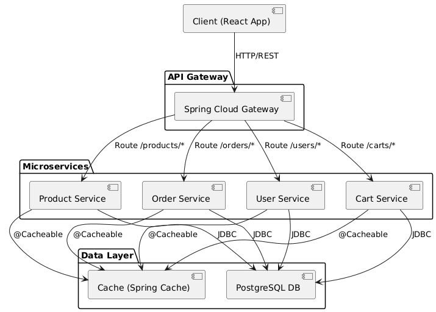
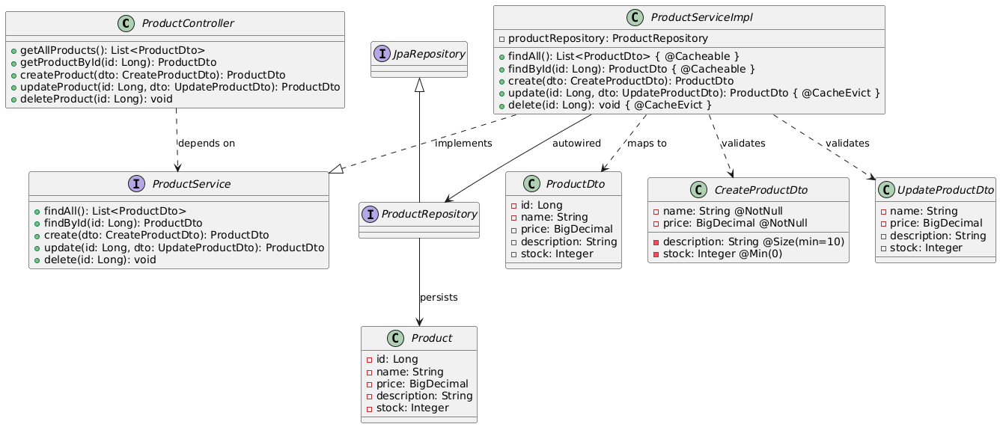

# Анализ архитектуры
## Часть 1. Проектирование архитектуры «To Be»
### 1. Тип приложения
Приложение относится к типу **REST-сервис**. В его основе лежат четыре ключевые модели данных — Product (телефоны и товары), Order (заказы), User (пользователи), Cart (корзины) — каждая из которых управляется отдельным микросервисом и имеет собственный REST API. Фронтенд на React взаимодействует с этими API для отображения каталога, управления корзиной, оформления заказов и аутентификации пользователей.

### 2. Стратегия развертывания
Проект использует **нераспределенное контейнеризированное развертывание** с акцентом на изоляцию сервисов и простоту локального запуска.
- **Компоненты системы:**
    - *Сервисный уровень:* Четыре микросервиса (Product, Order, User, Cart), каждый реализует REST API для работы со своей моделью данных.
    - *Уровень данных:* Единая СУБД *PostgreSQL*, обеспечивающая хранение всех сущностей (продукты, заказы, пользователи, корзины).
    - *Уровень кэширования:* Комбинированное использование *Spring Cache* (декларативное кэширование на уровне методов) и собственного программного кэша для оптимизации часто выполняемых запросов (например, каталог продуктов) и снижения нагрузки на базу данных.
- **Контейнеризация:** Каждый микросервис упаковывается в отдельный Docker-образ для изоляции зависимостей и упрощения переноса между средами. Для всего проекта создан единый Docker-файл, описывающий процесс сборки сервисов.
- **Локальный запуск:** Предусмотрен упрощенный локальный запуск через `docker-compose`, что позволяет быстро поднять полный стек приложения (все 4 сервиса + база данных + фронтенд React) одной командой без необходимости ручной настройки инфраструктуры.
- **Фронтенд:** React-приложение, развертываемое как статический контейнер (например, через Nginx в Docker), взаимодействует с бэкендом через REST API.

### 3. Обоснование выбора технологий
| Технология | Назначение | Обоснование |
| :--- | :--- | :--- |
| **Java 21 & Spring Boot 3.4+** | Основной стек разработки | Обеспечивают высокую производительность (Virtual Threads) и мощную экосистему для быстрой разработки микросервисов. Используется во всех четырех сервисах (Product, Order, User, Cart). |
| **PostgreSQL** | Основная реляционная СУБД | Выбрана для хранения всех структурированных данных приложения (продукты, заказы, пользователи, корзины) благодаря надежности, поддержке транзакций и целостности связей между сущностями. |
| **Spring Cache + Собственный кэш** | Кэширование данных | Комбинация декларативного Spring Cache (для аннотационного кэширования часто запрашиваемых данных) и собственного программного кэша позволяет снизить нагрузку на PostgreSQL и ускорить ответы REST API. |
| **Docker + `docker-compose`** | Контейнеризация и оркестрация | Каждый микросервис упаковывается в отдельный Docker-образ для изоляции окружения. Docker Compose объединяет все 4 сервиса, PostgreSQL и React-фронтенд для простого локального развертывания одной командой. |
| **React** | Фронтенд | Легковесный фреймворк для создания динамического UI, интегрируется с REST API для отображения каталога телефонов, управления корзиной и заказами. |

### 4. Показатели качества
- **Масштабируемость:** Разделение логики по четырем доменным модулям (Product, Order, User, Cart) позволяет при необходимости горизонтально масштабировать наиболее нагруженные компоненты независимо друг от друга.
- **Производительность:** Многоуровневое кэширование с использованием Spring Cache снижает нагрузку на базу данных при частых запросах к справочным данным (список продуктов, корзины). Собственный программный кэш оптимизирует работу с тяжелыми вычислительными операциями в сервисном слое.
- **Сопровождаемость (Supportability):** Кодовая база организована по четкой слоистой архитектуре: контроллеры (обработка HTTP-запросов) → сервисы (бизнес-логика) → репозитории (доступ к данным). Использование DTO (Data Transfer Objects) отделяет внутреннее представление сущностей от данных, возвращаемых клиенту, что упрощает внесение изменений в API без ломки внутренней логики.
- **Надежность:** Валидация входящих данных на уровне DTO с использованием стандартных аннотаций (`@NotNull`, `@Size` и др.) предотвращает попадание некорректных данных в базу данных и бизнес-логику.
- **Тестируемость:** Благодаря слабой связности компонентов (контроллеры зависят от интерфейсов сервисов, сервисы — от интерфейсов репозиториев) обеспечивается возможность модульного тестирования каждого слоя изоляции с использованием моков.

### 5. Реализация сквозной функциональности (Cross-cutting functionality)
- **Обработка исключений:** Централизованное управление ошибками через `@RestControllerAdvice`. Специализированные обработчики (`GlobalExceptionHandler`) перехватывают различные типы исключений (например, `ResourceNotFoundException`, `ValidationException`) и возвращают клиенту унифицированные ответы с понятными сообщениями об ошибках и соответствующими HTTP-статусами.
- **Валидация:** Применение спецификации Jakarta Bean Validation на уровне DTO. Аннотации `@NotNull`, `@Size`, и другие обеспечивают автоматическую проверку корректности входных данных перед передачей в сервисный слой, что предотвращает попадание невалидных данных в бизнес-логику.
- **Маппинг сущностей:** Преобразование между сущностями БД и DTO выполняется с использованием Lombok и ручного маппинга в сервисах, что обеспечивает четкое разделение между внутренним представлением данных и контрактами API.
- **Кэширование:** Реализовано на двух уровнях: с использованием аннотаций Spring Cache (@Cacheable, @CacheEvict) для часто запрашиваемых, редко изменяемых данных (например, списки продуктов) и кэш в сервисном слое для оптимизации ресурсоемких вычислений и снижения нагрузки на базу данных.

### 6. Структурная схема приложения

**Описание схемы:**
1. **Functional Blocks:** Система разделена на четыре доменных микросервиса (Product, Order, User, Cart), каждый из которых отвечает за работу с конкретной сущностью предметной области.
2. **Functional Layers:** Внутри сервисов обозначены слои API/Controller, Business Logic (Service) и DAO/Repository.
3. **Connections:**
    - **Синхронные (HTTP/REST):** Все клиентские запросы проходят через единую точку входа — API Gateway (Spring Cloud Gateway), который маршрутизирует их к соответствующим сервисам на основе пути запроса.
    - **Data Access:** Прямое взаимодействие сервисов со своими БД и кэшем.

---
## Часть 2. Анализ архитектуры «As Is»
В этой части представлена архитектура системы «как она есть», основанная на типичном коде для онлайн-магазина телефонов. Для генерации диаграммы классов выбран процесс доступа к данным продуктов (Product), так как он демонстрирует типичный flow работы с любой сущностью в системе (Product, Order, User, Cart) и показывает взаимодействие всех слоев приложения.

**Особенности реализации «As Is»:**
- **Стандартная слоистая архитектура:** В проекте четко разделены уровни представления (контроллеры), бизнес-логики (сервисы) и доступа к данным (репозитории), что обеспечивает высокую сопровождаемость кода.
- **DTO как контракты API:** Для отделения внутреннего представления сущностей от внешнего API используются Data Transfer Objects (`CreateProductDto`, `UpdateProductDto`, `ProductDto`), что позволяет изменять внутреннюю модель без ломки клиентских интеграций.
- **Двухуровневое кэширование:** Реализовано через Spring Cache абстракцию с собственным провайдером. Аннотации `@Cacheable` и `@CacheEvict` применяются в сервисном слое для оптимизации часто выполняемых запросов (поиск по ID, получение всех записей).
- **Монолитная база данных:** В отличие от паттерна *Database per Service*, все сущности (продукты, заказы, пользователи, корзины) хранятся в единой PostgreSQL, что упрощает транзакционную целостность, но потенциально усложняет масштабирование.
- **Отсутствие единой точки входа:** Клиент (React) обращается напрямую к контроллерам соответствующих сервисов (например, `ProductController`), так как в архитектуре не предусмотрен API Gateway.

---
## Часть 3. Сравнение и рефакторинг
### 1. Сравнение архитектур «As Is» и «To Be»
| Критерий | Архитектура «To Be» (План) | Архитектура «As Is» (Реальность) |
| :--- | :--- | :--- |
| **Связанность** | Слабая (независимые сервисы с четкими контрактами через REST API) | Умеренная (каждый сервис работает с общей БД, но без жестких синхронных вызовов) |
| **Оркестрация** | Через API Gateway как единую точку входа с маршрутизацией запросов | Отсутствует (клиент обращается напрямую к контроллерам сервисов) |
| **Слои** | Сохранение слоистой архитектуры с выделением DTO для API контрактов | Четкое разделение Controller/Service/Repository внутри каждого сервиса |
| **Отказоустойчивость** | Добавление `Resilience4j` с паттернами повторных попыток и таймаутов | Отсутствует (нет механизмов retry, circuit breaker, fallback) |
| **Кэширование** | Системное кэширование с единой стратегией инвалидации и TTL | Реализовано частично (Spring Cache + собственный кэш в сервисах) |
| **Обработка ошибок** | Расширение с детализированными кодами ошибок и локализацией сообщений | Централизованная через GlobalExceptionHandler |
| **Доступ к данным** | Выделение отдельных схем или БД под каждый сервис (*Database per Service*) | Единая PostgreSQL для всех сервисов (логическое разделение таблиц)|

### 2. Анализ отличий и их причины
- **Отсутствие единой точки входа (API Gateway):** В текущей реализации клиенты (React) обращаются напрямую к контроллерам каждого сервиса (`ProductController`, `OrderController` и т.д.).
  **Причина:** Простота разработки и отладки на начальном этапе. Отсутствие дополнительного слоя инфраструктуры ускоряет запуск и тестирование функциональности. Однако это приводит к дублированию сквозной функциональности (безопасность, логирование, мониторинг) в каждом сервисе.
- **Единая база данных PostgreSQL:** Все четыре сервиса работают с одной общей базой данных, имея доступ к таблицам других сервисов (например, `OrderService` может обращаться к таблице `products`).
  **Причина:** Упрощение транзакционной целостности и поддержки ссылочной целостности на уровне БД (`foreign keys` между `orders` и `products`). Это типично для начальной стадии проекта, когда микросервисы эволюционируют из монолита. Однако это нарушает принцип слабой связанности (database per service) и создает риск "связанности через данные".
- **Частичное кэширование:** Реализовано через Spring Cache и собственный кэш, но стратегия инвалидации не унифицирована (разные TTL, ручная очистка).
  **Причина:** Поэтапное внедрение оптимизаций. Кэширование добавлялось точечно под конкретные "горячие" запросы без единой архитектурной стратегии. В результате некоторые сервисы могут возвращать устаревшие данные при обновлении связанных сущностей в других сервисах.
- **Отсутствие безопасности (JWT, Security):** В текущей версии нет аутентификации и авторизации — любой клиент может вызывать любые эндпоинты.
  **Причина:** На начальном этапе разработки фокус был на реализации бизнес-логики, а не на инфраструктурных аспектах. Безопасность часто откладывается "на потом", что создает технический долг и риски при открытии системы для реальных пользователей.
- **Отсутствие отказоустойчивости:** Нет механизмов повторных попыток (retry), таймаутов или паттерна Circuit Breaker.
  **Причина:** В текущей архитектуре отсутствуют синхронные межсервисные вызовы (сервисы не вызывают друг друга по HTTP), поэтому потребность в таких механизмах не возникала. Однако при переходе к целевой архитектуре с раздельными БД появятся межсервисные запросы, что потребует внедрения паттернов устойчивости.

### 3. Пути улучшения архитектуры (Рефакторинг)
1. **Внедрение Shared Library (Общая библиотека)**
    - *Проблема:* Дублирование DTO (`ErrorResponse`, `ProductDto`-подобных структур), кода маппинга Entity ↔ DTO в каждом сервисе, а также идентичных конфигураций (CORS, валидация).
    - *Решение:* Вынести общие компоненты в отдельный Maven/Gradle модуль (например, common-lib), подключаемый ко всем сервисам.
2. **Внедрение API Gateway как единой точки входа**
    - *Проблема:* Клиенты обращаются напрямую к разным сервисам, что усложняет управление версиями API, логирование и добавление сквозной безопасности. Отсутствует централизованный контроль трафика.
    - *Решение:* Добавить в инфраструктуру Spring Cloud Gateway или аналогичное решение.
3. **Миграция к Database per Service**
    - *Проблема:* Все сервисы используют общую базу данных PostgreSQL, обращаясь к таблицам друг друга (например, `OrderService` читает `products`). Это создает скрытую связанность и не позволяет масштабировать сервисы независимо.
    - *Решение:* Поэтапное выделение отдельных схем или физических баз данных под каждый сервис.
4. **Внедрение безопасности (JWT + Security)**
    - *Проблема:* Полное отсутствие аутентификации и авторизации — критические уязвимости при публичном доступе.
    - *Решение:* Реализовать JWT-аутентификацию.
5. **Внедрение отказоустойчивости (Resilience4j)**
    - *Проблема:* При будущем разделении БД появятся межсервисные HTTP-вызовы, которые могут завершаться сбоями.
    - *Решение:* Добавить в сервисы паттерны устойчивости через *Resilience4j*.

---
### Заключение
Текущая архитектура «As Is» представляет собой работоспособную монолитную систему с зачатками микросервисного подхода (логическое разделение по доменам). Основные проблемы связаны с общей базой данных, отсутствием безопасности и единой точки входа. Рефакторинг в сторону «To Be» сделает систему более масштабируемой и безопасной для онлайн-магазина телефонов.
